[简体中文](./README.md) · [Website](https://tensorsentry.lei6393.com) · [GitHub](https://github.com/SuperMarioYL/tensorsentry)

<picture>
  <source media="(max-width: 600px) and (prefers-color-scheme: dark)" srcset="./assets/presentation/hero-mobile-dark.svg">
  <source media="(max-width: 600px)" srcset="./assets/presentation/hero-mobile-light.svg">
  <source media="(prefers-color-scheme: dark)" srcset="./assets/presentation/hero-dark.svg">
  
</picture>

# tensorsentry

**Inspect tensor structure before loading a checkpoint.**

TensorSentry reads tensor names, dtypes and shapes, compares them with a declared profile, and reports structural anomalies.

## Why use it

A model loader can fail late when a checkpoint has missing projections or mismatched shapes. Metadata checks surface these disagreements before the main load path allocates model tensors.

- **Check metadata first** — Shape checks do not require inference execution.
- **Declare the expected structure** — Profiles make required tensor constraints explicit.
- **Separate check results** — Structure, exploit and provenance statuses have different meanings.

## Architecture

<picture>
  <source media="(max-width: 600px) and (prefers-color-scheme: dark)" srcset="./assets/presentation/architecture-mobile-dark.svg">
  <source media="(max-width: 600px)" srcset="./assets/presentation/architecture-mobile-light.svg">
  <source media="(prefers-color-scheme: dark)" srcset="./assets/presentation/architecture-dark.svg">
  
</picture>

Container readers expose a common tensor view. The structural validator applies TensorProfile requirements, including declared MoE and MLA constraints. The scanner combines structure with the pickle scanner adapter; provenance is currently a separate unimplemented stage.

| Component | Responsibility |
| --- | --- |
| `Header reader` | safetensors_reader / gguf_reader |
| `TensorProfile` | Declared names and shapes |
| `Structure validator` | tensor_validate.py |
| `Combined report` | scanner.py; report.py |

## Install and quickstart

Build with the version declared in the repository manifest. Run the example from the repository root.

```bash
git clone https://github.com/SuperMarioYL/tensorsentry.git
cd tensorsentry
uv venv .venv
uv pip install --python .venv/bin/python -e .
source .venv/bin/activate
```

Generate a tiny safetensors file in a temporary directory, check its explicit shape profile, then show the missing-tensor rejection on an empty input.

```bash
PYTHONPATH=src python3 examples/presentation-demo.py
```

## Recorded demo

<picture>
  <source media="(max-width: 600px) and (prefers-color-scheme: dark)" srcset="./assets/presentation/process-mobile-dark.svg">
  <source media="(max-width: 600px)" srcset="./assets/presentation/process-mobile-light.svg">
  <source media="(prefers-color-scheme: dark)" srcset="./assets/presentation/process-dark.svg">
  
</picture>

The real tiny tensor passes its demo profile; an empty tensor set produces a missing-tensor anomaly.

```text
{
  "fixture_profile": "demo-linear",
  "tensor_count": 1,
  "valid_structure": "ok",
  "empty_structure": "anomaly",
  "missing_codes": [
    "missing_tensor"
  ]
}
```

The complete command and output are recorded in [docs/demo-results.json](./docs/demo-results.json). Inputs and reproduction code are included in the repository.


The existing recording is retained for context; the text example above documents the reproducible scenario.

## Usage

The CLI exposes the following operations. Commands after the example use your own paths or identifiers.

```bash
tensorsentry profiles
tensorsentry validate <profile-id> model.safetensors
tensorsentry scan --model <profile-id> ./checkpoint --json
```

## Configuration

Select a registered profile only after comparing its assumptions with the actual model. The Python API accepts an explicit TensorProfile, which the demo uses for a two-value F32 tensor. The header parser does not load a model into an inference runtime.

## Integrations and responsibilities

<picture>
  <source media="(max-width: 600px) and (prefers-color-scheme: dark)" srcset="./assets/presentation/integrations-mobile-dark.svg">
  <source media="(max-width: 600px)" srcset="./assets/presentation/integrations-mobile-light.svg">
  <source media="(prefers-color-scheme: dark)" srcset="./assets/presentation/integrations-dark.svg">
  
</picture>

The following routes are implemented in the source. Choose the input that matches your task and keep the resulting artifact with your project.

| Route | Implemented role |
| --- | --- |
| safetensors | Header metadata parsing |
| GGUF | Tensor metadata adapter |
| TensorProfile | Declared structural rules |
| picklescan | Exploit-scanning integration |
| JSON report | Structured scan findings |

## Limits and next steps

- Profiles are repository declarations and must be checked against your exact checkpoint architecture; a named profile does not establish current vendor specifications.
- A structural pass does not prove provenance, numerical correctness or absence of every exploit. Provenance verification is not implemented.
- The demo uses a custom demo-only profile and a tiny valid tensor file. It does not evaluate real model weights or pickle detection.

Provenance verification and runtime integration remain future work. Additional profiles need representative checkpoint evidence.

## License and contributions

See [LICENSE](./LICENSE). When reporting an issue, include a minimal input, the command, and the observed output.
