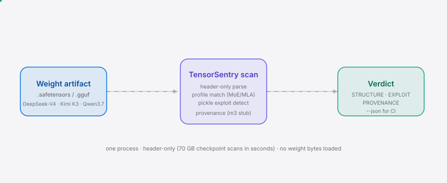
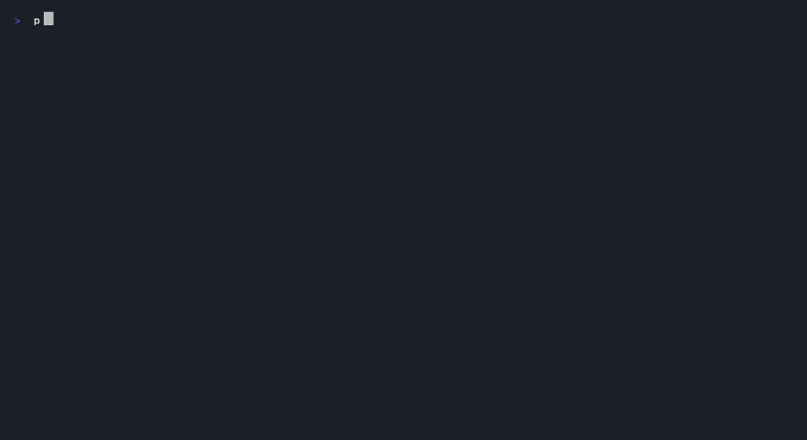

<div align="right"><sub><b><a href="./README.en.md">English</a></b>&nbsp;&nbsp;⇄&nbsp;&nbsp;中文</sub></div>

<picture>
  <source media="(prefers-color-scheme: dark)" srcset="./assets/hero-dark.svg">
  <source media="(prefers-color-scheme: light)" srcset="./assets/hero-light.svg">
  
</picture>

<p align="center"><sub>DeepSeek-V4 / Kimi K3 / Qwen3.7 权重制品在 agent 加载前的 MoE/MLA 张量结构 + pickle exploit 验证哨兵。</sub></p>

**在 agent 调用 `load_model()` 之前，先把投毒的国产权重挡在门外。** 2025 年 Hugging Face 入侵证明注册表门挡不住投毒权重，而 picklescan 认不出一个 DeepSeek MLA 权重——TensorSentry 在加载前验证每个国产模型的 MoE/MLA 张量结构，并探测 pickle/code-exec exploit。

<p align="center">
  <a href="./LICENSE"></a>
  <a href="https://github.com/SuperMarioYL/tensorsentry/releases"></a>
  <a href="https://github.com/SuperMarioYL/tensorsentry/actions/workflows/ci.yml"></a>
  
  
</p>

## 内容
- [架构](#架构)
- [为什么需要](#为什么需要)
- [安装与快速开始](#安装与快速开始)
- [用法](#用法)
- [Demo](#demo)
- [对比 picklescan](#对比-picklescan)
- [路线图](#路线图)
- [License](#license)
- [分享](#分享)

<h2> 架构</h2>

<picture>
  <source media="(prefers-color-scheme: dark)" srcset="./assets/atlas-dark.svg">
  <source media="(prefers-color-scheme: light)" srcset="./assets/atlas-light.svg">
  
</picture>

一个 Python 进程，一个 CLI。读取器只解析头（tensor 名/shape/dtype），从不加载完整权重，所以 70 GB 检查点几秒扫完。核心原语是 `TensorProfile`——一个声明式的、按模型定义的 MoE/MLA 张量结构 schema，这是通用 pickle 扫描器结构性缺失、且没有理由编码的那一块。

```
cli.py ──► scanner.py (orchestrator)
             ├─► safetensors_reader.py / gguf_reader.py   (header-only parse, no full load)
             ├─► tensor_validate.py ◄── model_profiles/{deepseek_v4,kimi_k3,qwen3_7}.py
             ├─► pickle_scan.py    (wraps picklescan lib — do not reinvent)
             └─► provenance.py     (ModelScope/HF API + sigstore verify — m3 stub)
          ──► report.py    (rich text + JSON)
```

<h2> 为什么需要</h2>

DeepSeek-V4 / Kimi K3 / Qwen3.7 每周经 ModelScope（魔搭）推送权重，agent 运行时默认把它们 `load_model()` 进 tool-calling 循环。2025 年的 Hugging Face 入侵（[Tailscale 承认没能挡住的 500 分 HN 帖子](https://tailscale.com/blog/hugging-face-intrusion)）让"权重是攻击面"从思想实验变成既成事实——可 picklescan 读的是任意 pickle 字节流找 code-exec，它无法断言"这个 DeepSeek MLA 权重必须含 `q_lora_rank=1536`/`kv_lora_rank=512` 的投影张量"，更认不出 Kimi K3 该有 896 个专家。**Agent 加载前的那一层按模型结构校验，正是国产镜像缺 HF 入侵后扫描的那一层。**

<h2> 安装与快速开始</h2>

```bash
pip install tensorsentry                                  # 或 uv tool install tensorsentry
tensorsentry profiles                                      # 列出支持的国产模型 profile
tensorsentry scan --model deepseek-v4 ./model.safetensors # 加载前验证结构 + 探测 exploit
```

<details><summary>从源码运行（开发）</summary>

```bash
git clone https://github.com/SuperMarioYL/tensorsentry && cd tensorsentry
pip install -e .
pytest -q
```
</details>

<h2> 用法</h2>

三个子命令覆盖 m1（结构验证）与 m2（结构 + exploit 组合扫描）：

```bash
# 列出已注册的国产模型 profile（MLA / MoE 结构 schema）
tensorsentry profiles

# m1 — 仅验证张量结构：DeepSeek-V4 的 MLA 投影 + 256 专家 MoE
tensorsentry validate deepseek-v4 ./model-00001-of-0000X.safetensors

# m2 — 结构 + exploit 组合扫描（也支持 .gguf 与整个模型目录）
tensorsentry scan --model deepseek-v4 ./deepseek-v4.gguf
tensorsentry scan --model kimi-k3 ./kimi-k3/          # 扫整个 ModelScope 拉取目录
tensorsentry scan ./suspect_dir                       # 不给 model → 只跑 exploit 探测

# CI gating：--json 输出 + 非零退出码
tensorsentry scan --model qwen3.7 ./qwen.safetensors --json
```

<details><summary>组合 verdict 输出示例</summary>

```
                      TensorSentry verdict — deepseek-v4 [safetensors]
┏━━━━━━━━━━━━━━━┳━━━━━━━━━━━━━━━┳━━━━━━━━━━━━━━━━━━━━━━━━━━━━━━━━━━━━━━━━━━━━━━┓
┃ Check         ┃ Status        ┃ Detail                                       ┃
┡━━━━━━━━━━━━━━━╇━━━━━━━━━━━━━━━╇━━━━━━━━━━━━━━━━━━━━━━━━━━━━━━━━━━━━━━━━━━━━━━┩
│ STRUCTURE     │ ok            │ 778 tensors, 2 layers, experts=256           │
│ EXPLOIT       │ clean         │ no __reduce__ / code-exec tensors found      │
│ PROVENANCE    │ unreachable   │ m3 milestone (stub) — not yet verified       │
└───────────────┴───────────────┴──────────────────────────────────────────────┘
```
</details>

<h2> Demo</h2>



从 `profiles` → `validate` → `scan` → `--json` 的 10 分钟快乐路径（`docs/demo.tape`，CI 用 vhs 渲染）。

<h2> 对比 picklescan</h2>

| 维度 | [picklescan](https://github.com/mmaitre314/picklescan) | TensorSentry |
|---|---|---|
| pickle code-exec 探测 | ✓（任意 pickle 字节流） | ✓（wrap picklescan，不重造） |
| 按模型 MoE/MLA 张量结构验证 | — | ✓ DeepSeek MLA 秩 + Kimi 896 专家 |
| .safetensors / .gguf 头只读扫描 | 部分 | ✓ 70 GB 检查点秒扫，不加载权重 |
| ModelScope/HF 分发面意识 | — | ✓ 国产镜像缺的那一层 |
| 维护成本 | 通用、substrate-agnostic | 需跟踪每个国产模型每周的 tensor schema |

picklescan 在"扫任意 pickle 找 code-exec"这件事上做得很好， TensorSentry 的不可替代性在于**按模型的结构校验**——这一层通用扫描器结构性做不到（见上表最后一行：维护每模型 schema 与它们的 substrate-agnostic 哲学相悖）。

<h2> 路线图</h2>

- [x] **m1** — safetensors reader + tensor_validate + deepseek-v4 MLA profile；`validate` 报告结构异常
- [x] **m2** — pickle_scan（wrap picklescan）+ gguf_reader + kimi-k3 / qwen3.7 profile；`scan` 输出结构+exploit 组合 verdict
- [ ] **m3** — provenance（ModelScope/HF manifest + sigstore）+ report 精修 + PyPI 发布 + Gitee 镜像；端到端 `pip install tensorsentry` ready for Show HN
- [ ] v0.2 — agent-runtime `load_model()` 前置 hook + CI gate 插件（当前 `out_of_scope`，下一个楔子）

<h2> License</h2>

MIT，见 [LICENSE](./LICENSE)。Issue / PR 欢迎：[github.com/SuperMarioYL/tensorsentry/issues](https://github.com/SuperMarioYL/tensorsentry/issues)。推送后建议给仓库打 topic：`gh repo edit --add-topic agent-safety --add-topic supply-chain --add-topic safetensors`。

## 分享

```
TensorSentry — the agent-safety scanner that checks CN-model MoE/MLA tensor structure + pickle exploit before your agent loads the weight. HF intrusion proved weights are the attack surface; picklescan can't tell a DeepSeek MLA weight from a pickle. https://github.com/SuperMarioYL/tensorsentry
```

<p align="center"><sub><a href="./LICENSE">MIT</a> © 2026 SuperMarioYL</sub></p>
